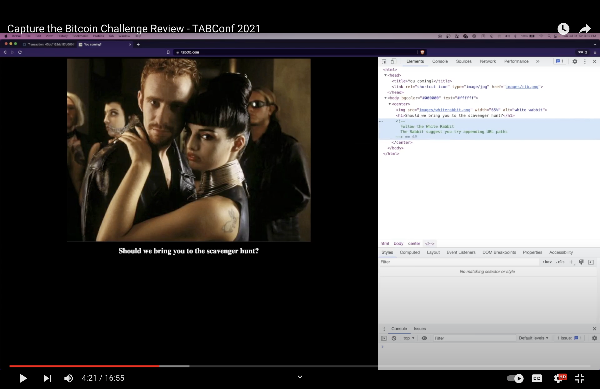

# Capture the Bitcoin Challenge (CTB)

TABConf 7 is bringing back the CTB challenge again this year! This scavenger hunt will test your knowledge of Bitcoin and challenge you to think creatively.

Join in on the fun and make new friends while learning something new. The goal is to be the first to snatch the bitcoin from a specific UTXO.

🎁 To get started, simply attend TABConf and pick up your challenge coin at the entrance.

### Watch the TABConf 6 CTB Recap Video below 👇

### Watch the TABConf 2021 CTB Recap Video below 👇

